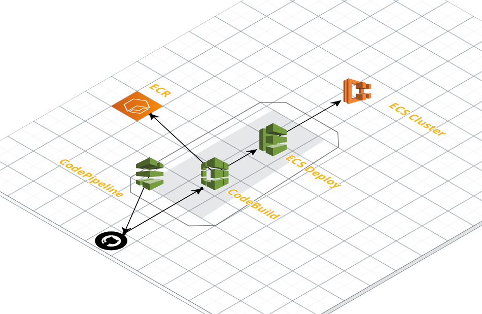
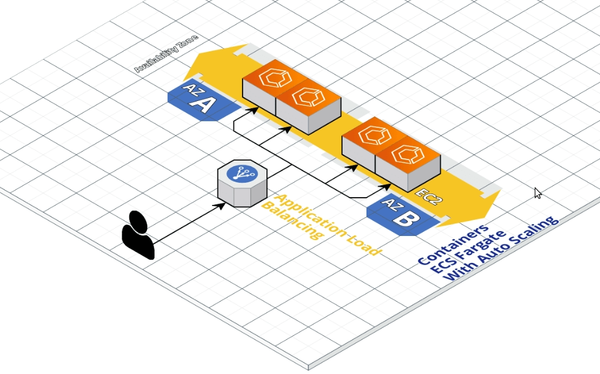
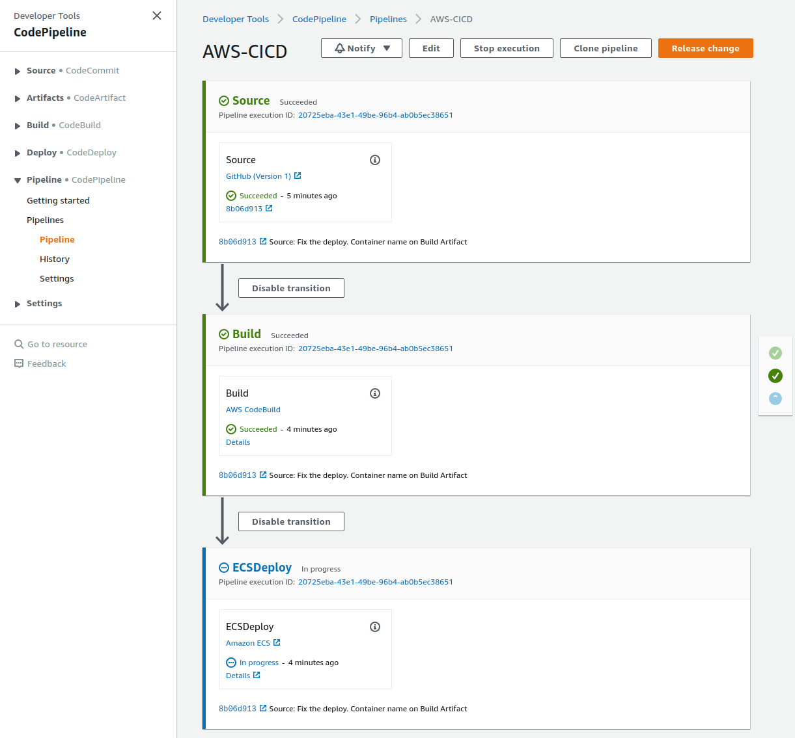
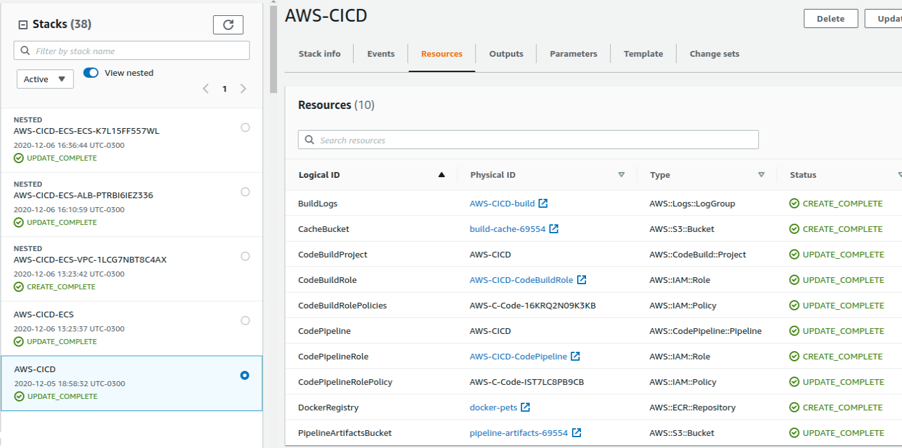
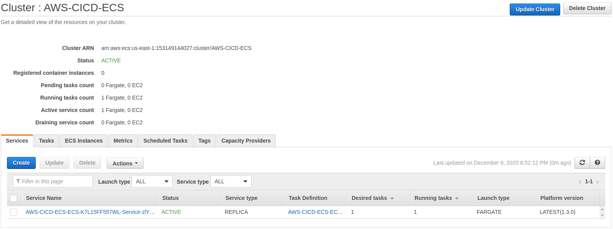
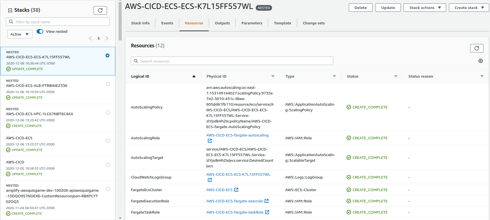
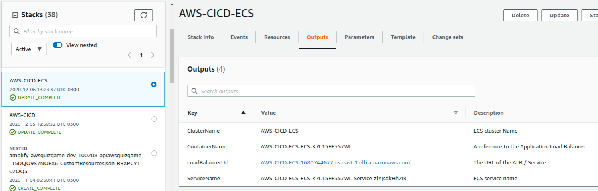
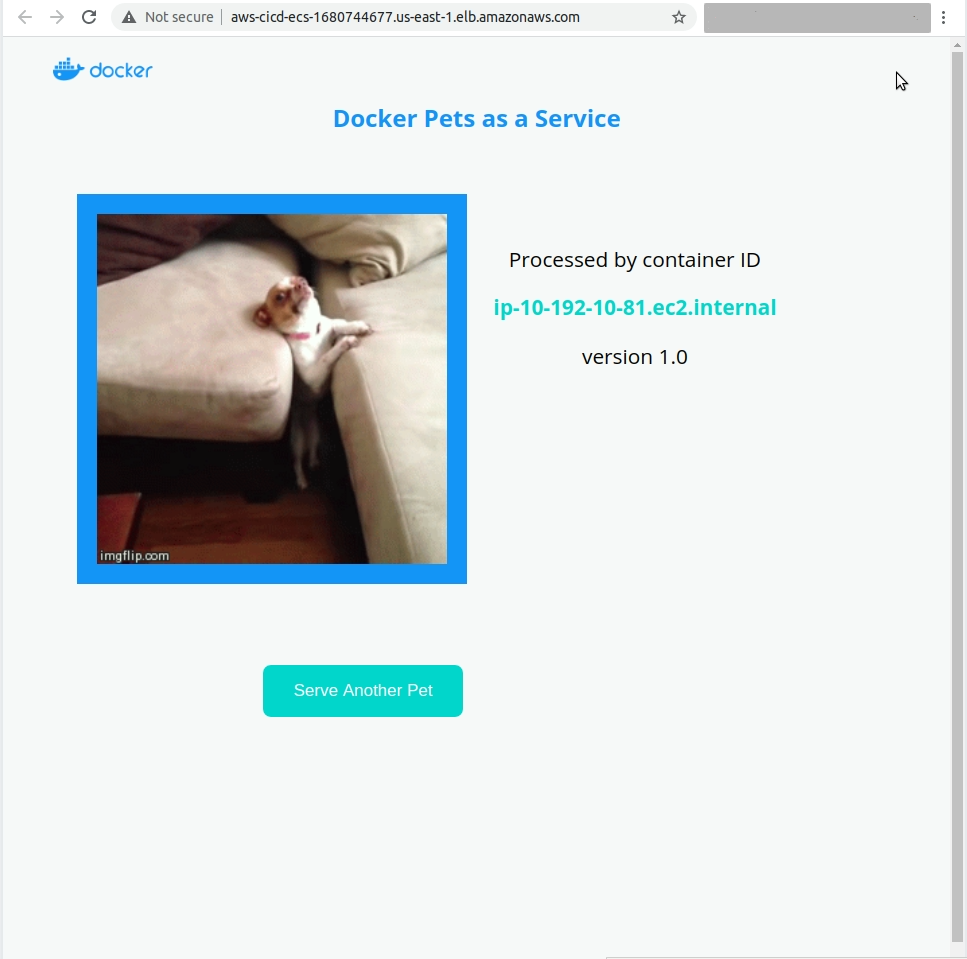
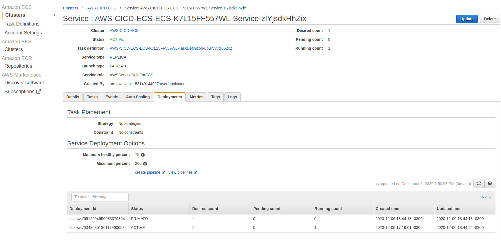

# AWS CICD ECS Docker Pets
AWS CICD ECS Docker Pets is a sample to run all infraestructure of some docker on AWS Cloud.
This project is run the docker on ECS and do all CI/CD process to update the container.

# About Docker Pets
Docker Pets is a simple application that's useful for testing out features of Docker Enterprise Edition.
To you want, go to [Original Project Docker pets](https://github.com/docker-archive/docker-pets).

# Before start
Fork the project to your github. It is necessary to you change some code and test your changes.
CodePipeline need a Github OAuthToken, to generate it go to [https://github.com/settings/tokens]](https://github.com/settings/tokens) click on generate new token, select "public_repo" option and click on Generate Token.
Copy the token generated and save it.
If you change the environment, you need to create a S3 bucket, send the yml files (ecs, loadlanancer, vpc) and replace inside full-environment.yml the S3 file Url.

# CI/CD
For this CI/CD, is used github as source, CodeBuild, CodePipeline and ECS to deploy the new Conainer.
The Artifacts inside pipeline are stored inside a S3. It is necessary to download source to build and store artifact from build to use in deploy step.
You can see all logs from build inside CodeBuild, but it is stored on CloudWatch.

## Running with Console Mode
Log in AWS console and go to [CloudFormation](https://console.aws.amazon.com/cloudformation/home?region=us-east-1).
Verify the region that you want to run the sample. You can choose which one you can.
Create a new stack with Pipeline.yml file

## Running with Cli Mode
If you want to run with cli, don't forget to confirm your aws credentials is configured and working.
You can configure with aws configure. If you want instructions, follow the [quickstart](https://docs.aws.amazon.com/cli/latest/userguide/cli-configure-quickstart.html).

You can run the CloudFormation from cli. I did prepare a shell script to update the cloudformation, but you can chance the comand to run the creation too.
Modify the pipeline-update.sh changing the command from `aws cloudformation update-stack` to `aws cloudformation create-stack`

## Parameters
When you run create the stack CloudFormation on Console or before you run the Shell command, you need especify some parameters to CFN works fine.
If your are on console, the parameters necessaries will show to you on second screen of CloudFormation Creation.
If your are on cli, see the variables on Shell script.
You can see the parameters on .yaml files (CloudFormation script file)

S3 name is unique, because that you need change the parameters: PipelineArtifactsBucketName and BuildCacheBucketName to what you want (you can change the number on final of string to work)

githubProjectUrl is the url of your forked project and githubOAuthToken is the OAuthToken generated for you.

The ClusterName and ServiceName are populated after creat the environment. Dont worry about it

# ECS environment
The environment is based with ECS Fargate.
To create, it needs a VPC, Loadbalancer to get the connection and send to pets container, ECS Claster (Fargate mode).
To the comunication between client, container and loadbalancer happen, the CloudFormation create 2 Security Groups. 1 to Loadbalancer whos Allow the Worlds communicate with ALB, and other to Container accept requests from LoadBalancer.

## Running
The same as Pipeline.
Log on console and create a stack with full-environment.yml or run the full-environment-update.sh

## Auto Scaling
Teh autoscaling runs with metric [ECSServiceAverageCPUUtilization](https://docs.aws.amazon.com/AmazonECS/latest/developerguide/service-autoscaling-targettracking.html)

## Outputs
To get the URL to access the result, go to CloudFormation console, Click on your Environment Stack and go to Output page.

### Open your pets website
Get the value of LoadBalancerUrl, put on a new tab of your browser and see the result.

### See the logs
Get the value of Logs, go to CloudWatch > Log Groups, search for the value of Logs Output.

# Enabling Deploy
After Create your environment to pets server. Lets fix the Deploy.
Go to CFN Stack to ECS Environment, go to Outputs and get the values of ClusterName, ContainerName and ServiceName.
Go to CFN Stack of CI/CD on console or popeline-update.sh. On Parameters, put the new values on respective places.
Commit something on github to Pipeline run again, or go to our CodePipeline create and click on release-chage button.

